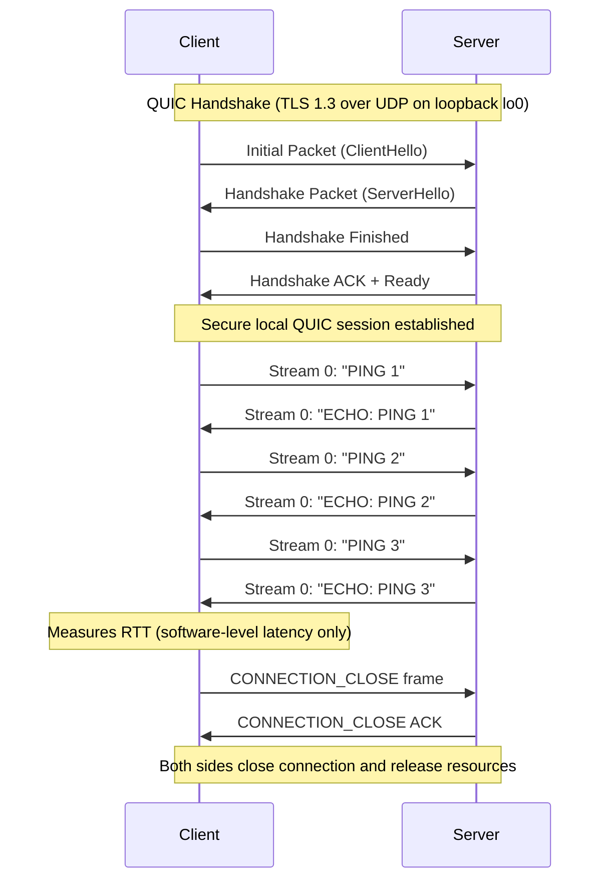

# QUIC Client–Server Demo (Local Loopback Test)

This stage of the project implements and validates a **minimal QUIC network system** operating entirely over the **local loopback interface (`lo0`)**.

The system consists of:

* A **server** that listens for incoming QUIC connections and echoes back messages.
* A **client** that connects locally to the server, sends periodic “PING” messages, and measures **round-trip time (RTT)**.

All communication occurs locally between `127.0.0.1` endpoints, enabling controlled, low-latency testing without external network interference. This setup focuses on verifying the **core lifecycle and internal mechanisms** of QUIC rather than network variability.


## Environment Setup and Configuration

Both the client and server initialize and configure their QUIC environments before exchanging packets.

### Server

* Generates a **self-signed TLS certificate and private key** (mandatory for QUIC encryption):

  ```bash
  openssl req -x509 -newkey rsa:2048 -keyout key.pem -out cert.pem -days 365 -nodes -subj "/CN=localhost"
  ```
* Configures protocol parameters:

  * Stream/data limits
  * Flow control settings
  * Idle timeout
* Binds a UDP socket to **`127.0.0.1:4433`** on the **loopback device (`lo0`)**, waiting for local incoming QUIC packets.

### Client

* Creates its own UDP socket bound to an ephemeral local port on `127.0.0.1`.
* Initializes QUIC configuration to match the server’s.
* Disables certificate verification (since the connection is local and self-signed).
* Prepares to initiate a QUIC connection to **`127.0.0.1:4433`**.

At this stage, both sides are fully initialized:
The server is listening locally on `lo0`, and the client is ready to start the handshake.


## Handshake Phase (Connection Establishment)

The client begins the QUIC handshake over **UDP on the loopback interface**.

1. **ClientHello:**
   The client sends an initial QUIC datagram containing its connection ID, chosen QUIC version, and embedded TLS handshake data.
2. **ServerHello:**
   The server receives this packet, creates a connection with `quiche_accept()`, and responds with its handshake message.
3. **Key Exchange:**
   Both sides negotiate session keys and derive encryption parameters using TLS 1.3 within QUIC.
4. **Ready State:**
   Once completed, both sides transition to encrypted communication.

Because all communication happens on `lo0`, the handshake completes within microseconds, allowing rapid iteration and testing.


## Data Exchange (Ping–Echo Loop)

After the handshake, application-level data is sent securely.

* The **client** periodically sends `"PING n"` messages over QUIC **stream 0**.
* The **server** receives each message, logs it, and responds with `"ECHO: PING n"`.
* The **client** records the **RTT** for each message by measuring the time between sending and receiving.

The ping–echo exchange continues until the client initiates a close.
Because this runs on loopback, RTT values primarily reflect software processing time and QUIC protocol overhead rather than network latency.


## Reliability and Flow Control (Automatic via `quiche`)

Even over the loopback interface, QUIC’s reliability features remain active. The **quiche** library manages:

* **Retransmissions** for any simulated packet loss,
* **ACKs** for reliable delivery,
* **Flow control** to prevent send buffer overflow, and
* **Per-packet encryption and authentication.**

To the application, communication appears as a **secure, ordered, bidirectional byte stream**, similar to TCP+TLS, but achieved with lower handshake latency and more flexible multiplexing.


## Connection Teardown

When the test completes or the client stops sending:

* The client transmits a **CONNECTION_CLOSE** frame.
* The server acknowledges it and releases all resources.
* Both sockets on `lo0` are closed and encryption keys discarded.

The cleanup ensures no lingering connection state on the local system.


## Conceptual Layer Mapping

| Layer              | Description                                                         |
| ------------------ | ------------------------------------------------------------------- |
| **Application**    | Sends/receives `"PING n"` ↔ `"ECHO: PING n"` messages               |
| **QUIC**           | Manages handshake, encryption, retransmissions, and streams         |
| **UDP**            | Transports encrypted QUIC packets locally                           |
| **Loopback (lo0)** | Provides zero-hop delivery between client and server on `127.0.0.1` |
| **OS Kernel**      | Routes packets internally without leaving the host machine          |


## Visual Overview

### Simplified Packet Exchange (Local Loopback Trace)

Wireshark traces (captured on `lo0`) confirm proper handshake and payload exchange:

| #    | Time (s)  | Src       | Dst       | Info                                    |
| ---- | --------- | --------- | --------- | --------------------------------------- |
| 1–5  | 0.00–0.01 | 127.0.0.1 | 127.0.0.1 | QUIC Initial + Handshake packets        |
| 6–37 | 0.01–8.68 | 127.0.0.1 | 127.0.0.1 | Protected Payloads (Ping–Echo exchange) |

### QUIC Lifecycle Diagram




## Summary

This local test successfully demonstrates the **complete lifecycle of a QUIC connection** on the loopback interface:

1. **Handshake** — Secure connection setup within a single RTT.
2. **Data Exchange** — Encrypted, reliable ping–echo traffic between local sockets.
3. **Measurement** — RTTs reflect internal protocol and application processing delays.
4. **Graceful Teardown** — Proper cleanup and resource release.

The current stage confirms that QUIC handshake, encryption, and data flow are functioning as expected in a controlled, zero-latency environment.
