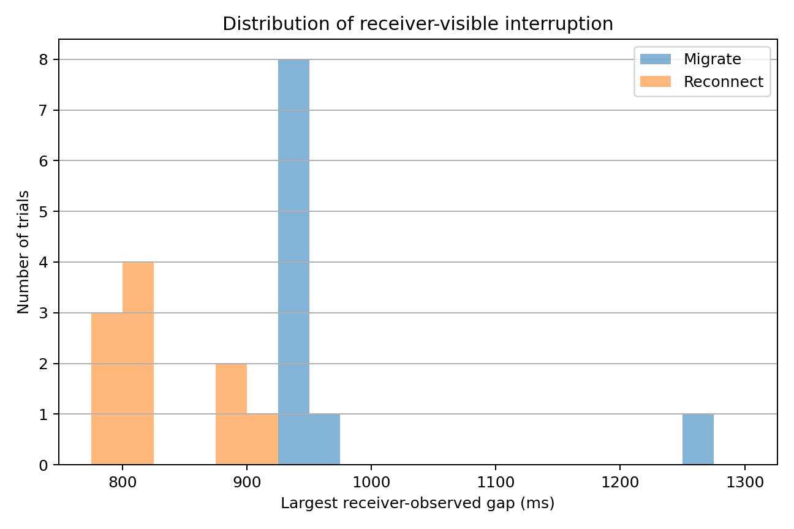
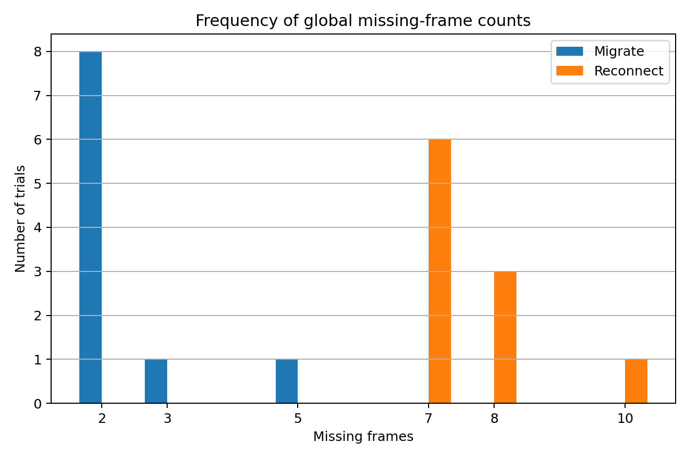

# Recovery comparison

## Experiment validity

The comparison uses the committed Epic 5.3 dataset:

```text
results/recovery-experiment-01/
├── summary.csv
└── runs/*.json
```

The experiment contains ten migration trials and ten reconnect trials. All 20
runs completed successfully, all result records were analyzable, and no trial
was excluded.

| Strategy | Total trials | Valid trials | Successful trials | Success rate | Analysis errors |
|---|---:|---:|---:|---:|---:|
| Migration | 10 | 10 | 10 | 100% | 0 |
| Reconnect | 10 | 10 | 10 | 100% | 0 |

No duplicate or out-of-order validated frames were observed.

## Main comparison

| Metric | Migration | Reconnect |
|---|---:|---:|
| Mean largest receive gap | 973.305 ms | 830.204 ms |
| Median largest receive gap | 937.373 ms | 802.026 ms |
| Mean missing frames | 2.400 | 7.600 |
| Median missing frames | 2 | 7 |
| Mean received unique frames | 57.600 | 52.400 |
| Mean sessions | 1 | 2 |
| Mean connections | 1 | 2 |

Across the tested runs, reconnect restored receiver activity sooner, while
migration preserved more media frames and retained the existing transport and
application-session identity.

## Receiver-visible interruption

`largest_receive_gap_ms` is the primary cross-strategy interruption metric. It
measures the largest interval between validated frames at the receiver using a
server-wide monotonic clock.

| Strategy | Count | Minimum | Mean | Median | Maximum | Sample standard deviation |
|---|---:|---:|---:|---:|---:|---:|
| Migration | 10 | 935.251 ms | 973.305 ms | 937.373 ms | 1268.395 ms | 103.802 ms |
| Reconnect | 10 | 798.919 ms | 830.204 ms | 802.026 ms | 899.513 ms | 47.937 ms |

Reconnect's median receive gap was approximately 135 ms shorter than
migration's median. The reconnect observations formed clusters around 800 ms
and 900 ms. Most migration observations were around 935–964 ms, with one
larger outlier.



*Figure 1. Distribution of the largest receiver-observed frame gap across ten
migration and ten reconnect trials. Reconnect produced shorter receiver-visible
interruptions in the tested Mininet scenario, while one migration trial showed
a substantially larger outlier.*

It uses shared 50 ms bins for both strategies.

## Frame preservation

Global frame counts are calculated across the complete `MediaRun`. For
reconnect, validated frames from S1 and S2 are unioned by `media_run_id`.
The S2-local receive summary is not used as the run-wide loss result.

| Strategy | Count | Minimum | Mean | Median | Maximum | Sample standard deviation |
|---|---:|---:|---:|---:|---:|---:|
| Migration | 10 | 2 | 2.400 | 2 | 5 | 0.966 |
| Reconnect | 10 | 7 | 7.600 | 7 | 10 | 0.966 |

Migration produced fewer missing frames in every tested run. Eight of ten
migration trials lost two frames, while reconnect most commonly lost seven or
eight frames.

The exact frequency plot is stored at:



*Figure 2. Frequency of global missing-frame counts across ten trials per
strategy. Migration usually lost two frames, whereas reconnect most commonly
lost seven or eight frames.*

## Transport identity

The measured identity behavior matches the implementation design.

| Property | Migration | Reconnect |
|---|---:|---:|
| Logical media runs | 1 | 1 |
| Quinn connections | 1 | 2 |
| QuicVid sessions | 1 | 2 |
| HELLO exchanges | 1 | 2 |
| Global frame timeline preserved | Yes | Yes |

Migration preserved the existing Quinn connection and QuicVid session through
endpoint rebind. Reconnect created a replacement connection and session on Path
B, sent another HELLO, and continued the same media run without restarting the
frame timeline.

## Strategy-specific action timing

Migration action timing is measured from `automatic_rebind_started` to
`migration_confirmed`. Reconnect action timing is measured from
`reconnect_started` to `reconnect_completed`.

These completion events do not represent the same end-to-end condition.
Migration waits for ACK-confirmed progress after rebind, while reconnect records
replacement-session establishment. The action-duration values are therefore
diagnostic and must not replace receiver-side frame gaps in the main
cross-strategy comparison.

## Outlier

`migrate-003` produced:

```text
largest receive gap:       1268.395 ms
recovery-action duration:   439 ms
missing frames:               5
```

The trial remained valid and is retained in all statistics and plots. The
median is less sensitive to this observation and is therefore useful alongside
the mean. The experiment does not provide enough evidence to classify the
outlier as either implementation behavior or host/Mininet scheduling
variability.

## Interpretation

The results show a trade-off rather than one universally superior strategy.

Reconnect:

- restored receiver activity sooner;
- replaced the Quinn connection and QuicVid session;
- required a second HELLO;
- preserved the logical media run and frame timeline.

Migration:

- preserved the existing Quinn connection and QuicVid session;
- lost fewer media frames;
- had a longer receiver-visible gap in this experiment;
- included one larger interruption outlier.

Both strategies completed every run successfully. The results therefore support
the feasibility of both recovery approaches, while showing that transport
continuity and receiver-visible recovery quality are separate properties.

## Limitations and threats to validity

The result applies to one controlled experiment configuration:

- ten trials per strategy;
- deterministic Mininet topology;
- one sustained Path A failure pattern;
- 10 fps and six-second media runs;
- one suspect threshold and one challenge threshold;
- one client and one server on the same experiment host;
- no physical Wi-Fi or mobile-network handover;
- no NetworkManager-triggered recovery;
- no TCP baseline;
- no timeout-triggered reconnect;
- no repeated recovery within one media run;
- no threshold or impairment sweep;
- no externally synchronized client/server clocks.

Receiver timing is measured using one server-process monotonic clock, which is
suitable for comparing frames within a run but is not an external wall-clock
measurement. The trial count is small, so individual observations, descriptive
statistics, and explicit limitations are preferred over strong inferential
claims.

## Conclusion

Across ten trials per strategy, both migration and proactive reconnect
completed every media run successfully. Reconnect produced a shorter
receiver-visible interruption, with a median largest receive gap of 802.0 ms
compared with 937.4 ms for migration. Migration preserved more media frames,
with a median of two missing frames compared with seven for reconnect.

Migration retained the existing Quinn connection and QuicVid session, whereas
reconnect established a replacement connection and session while continuing
the same logical media run and global frame timeline. The controlled experiment
therefore demonstrates two viable recovery mechanisms with different measured
trade-offs: reconnect favored earlier resumed reception, while migration
favored frame preservation and transport continuity.
